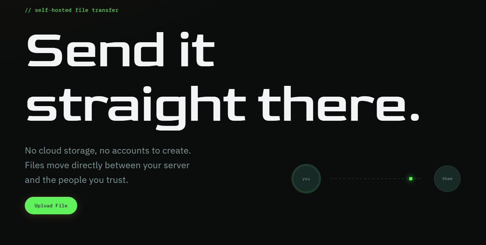
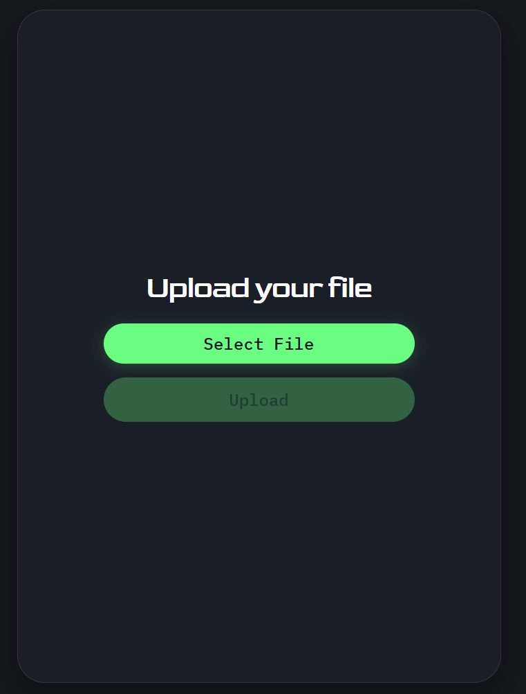
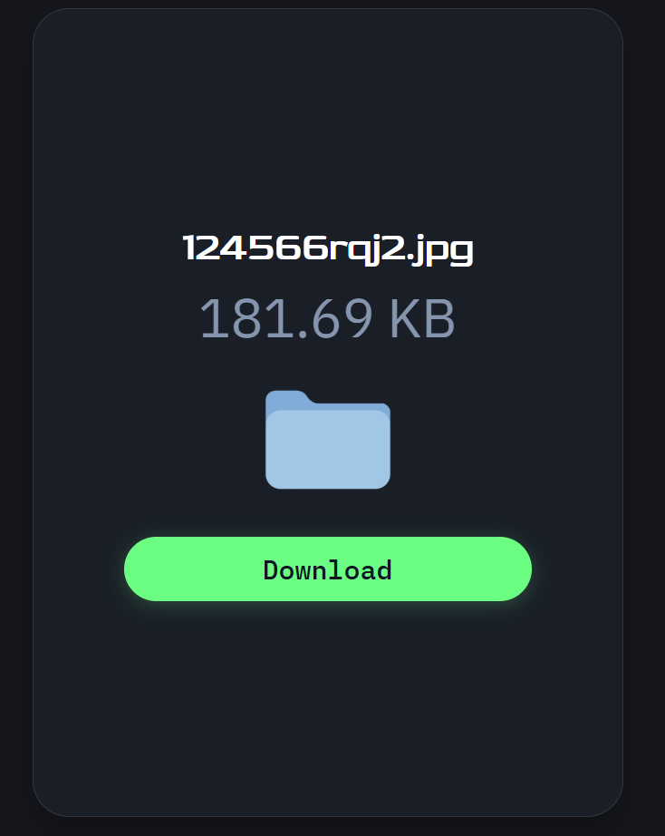

# FileSharer

## 🖼️Preview
### MainPage:


### UploadPage:


### DownloadPage:


## 🚀QuickStart
## Backend
``` Bash
cd backend
python -m venv .venv
# Linux/MacOS:
source .venv/bin/activate
# Windows:
.venv/scripts/activate
pip install -r requirements.txt
python -m db_functions.init_db
uvicorn main:app
```
## Frontend
``` Bash
cd frontend
npm install
# Create .env file in ./frontend with next format:
# VITE_API_URL=http://localhost:8000
npm run dev
```
## 🐳You also can run project in docker
### !!!Before this create db file in "./backend/"!!! 
``` Bash
docker compose up
```